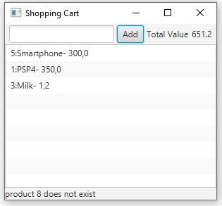

# Aplicação do Padrão observer

## Introdução
Vamos aplicar o Padrão Observer, para fazermos a separação entre a lógica da aplicação e a interface com o utilizador.
- Consideremos que o pacote Model contem as classes que contem as operações que manipula os dados.
- Consideramos que o pacote View tem as classes responsaveis por mostrar uma vista sobre os objecto do model e receber e processsar a interação do utilizador. 
- Sempre que as classes do Model modificam o seu seu estado, notificam a View para atualizar a vizualização da informação. 
## Exemplo
Pretende-se realizar uma aplicação para gerir a compra de produtos online - " carrinho de compras" que deverá ter a seguinte interface 

### Realize as modificações necessárias do código de forma a:
    - A classe Shopping Cart assume o papel de ConcreteSubject
    - A classe ShoppingCartUI assume o papel de ConcreteObserver
    - Sempre que o utilizador aciona o botão Add, um novo produto é adcionodo ao carrinho de compras
### Extra
    - Coloque um botão para remover produtos. E adicione o comportamento.
    - Adicione um alarme, para quando o valor total do carrinho exceder um determinado valor.
    
